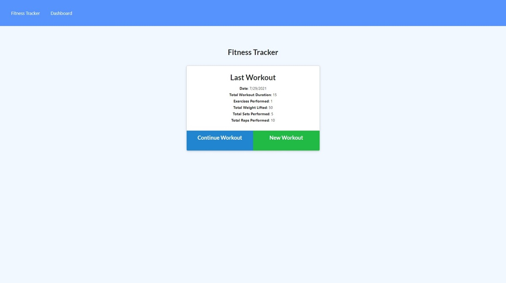
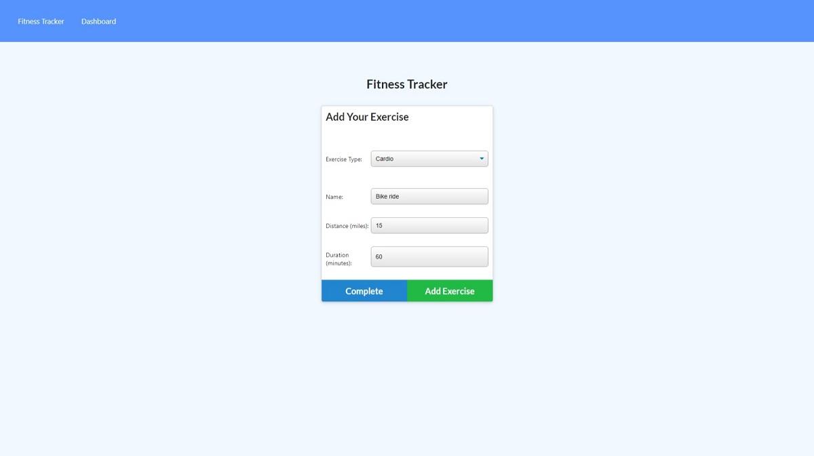
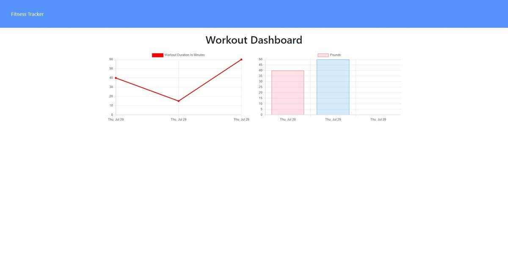

# WorkoutTracker

## Description

As people are looking to better their health, one emphasis is to ensure regular exercise and activity.  With the workout tracker app, the user will be able to keep track of their cardio and resistance activity by entering their individual workouts and see them displayed on graphs in the app's dashboard to help visually see their progress.  

When adding an exercise to the app, the user will be able to add an exercise to their current workout regimen if they are doing multiple exercises during one session so they can track all their activity for one period, or they can create a new exercise. When adding an exercise to the app, they will select if it is a cardio or resistance exercise and fill out the corresponding information for that particular exercise.

When the user enters the app's dashboard, the graphs will display exercise data for the past 7 days of their total time in minutes they have spent on working out, and the total weight that was lifted during resistance exercises.

## Table of Contents

- [Usage](#usage)
- [Contributing](#contributing)
- [Testing](#testing)
- [License](#license)
- [Resources](#resources)

## Usage

The app is deployed through Heroku, and can be found at https://workout-tracker0722.herokuapp.com/.

## Contributing

If you are looking to contribute to the project, you can fork the repo from its GitHub page.

You can find the project at https://github.com/JMan4342/WorkoutTracker.

## Testing

Below you will find screenshots of the different views of the workout tracker app.

## License

MIT

## Resources

I utilized the following sites to assist in creating the workout tracker app.

- https://dev.to/ichtrojan/basic-routing-http-requests-and-crud-operation-with-express-and-mongodb-od2
- https://stackoverflow.com/questions/33049707/push-items-into-mongo-array-via-mongoose

## Questions

If you have any questions, I can be reached on my GitHub at [JMan4342](https://github.com/JMan4342).

You can also reach me by email at manning.joseph.4342@gmail.com.